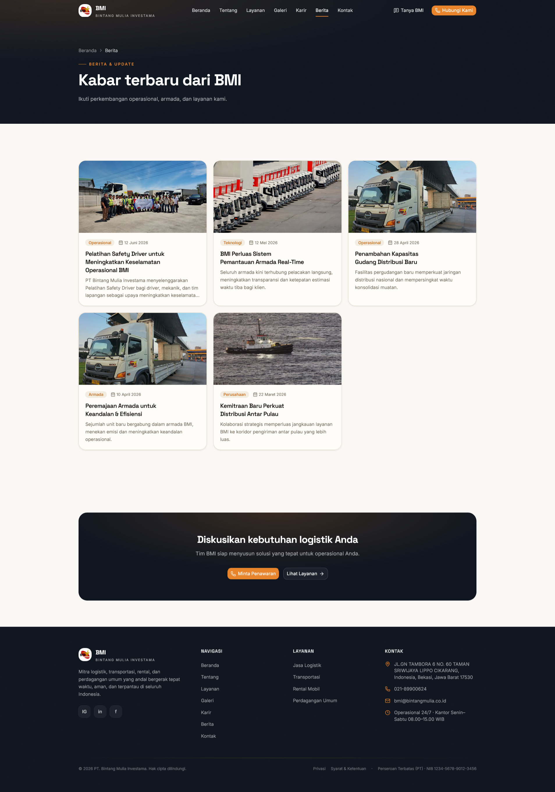
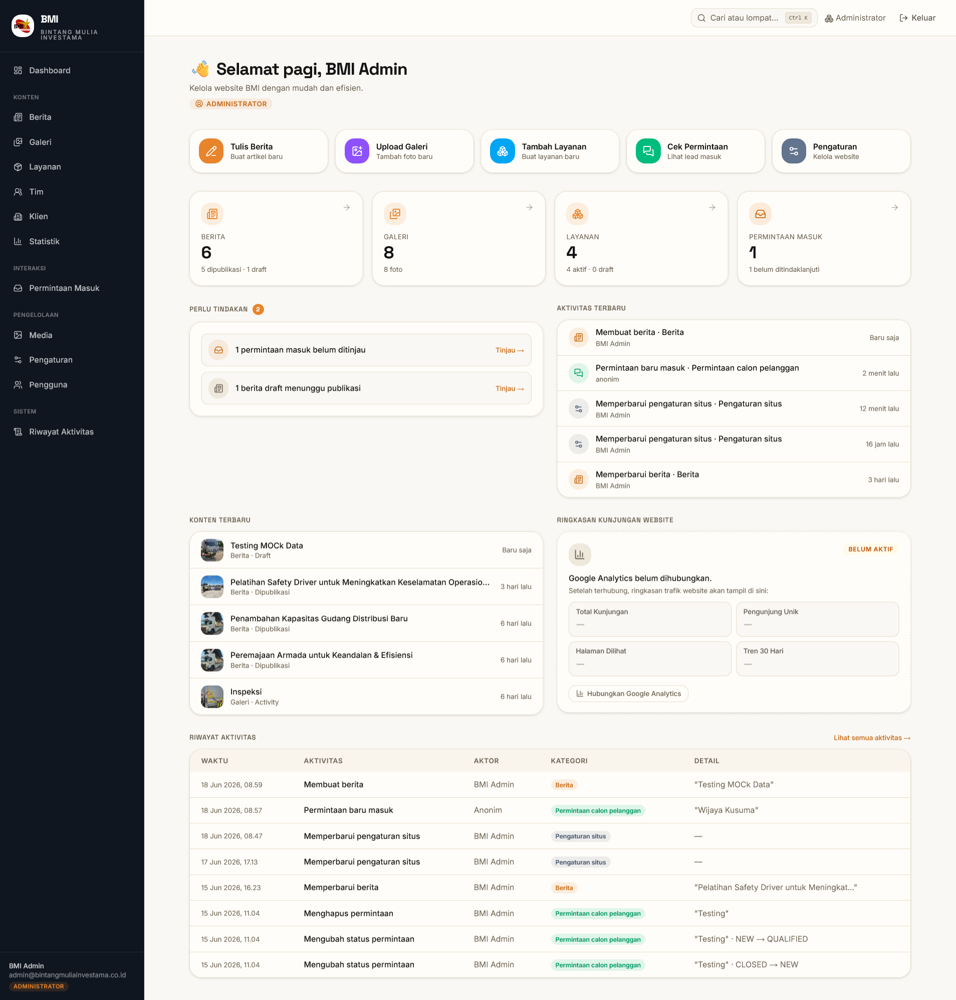

<div align="center">

# BMI Digital Platform

**Company-profile website + internal CMS for PT Bintang Mulia Investama (BMI)** —
an Indonesian logistics, transportation, vehicle-rental, and general-trading company.

[](https://nextjs.org)
[](https://react.dev)
[](https://www.typescriptlang.org)
[](https://tailwindcss.com)
[](https://www.prisma.io)
[](https://neon.tech)
[](LICENSE)

A single Next.js application that **(1)** presents the BMI brand to B2B customers and
**(2)** lets non-technical staff manage every piece of public content through a
protected `/admin` area — no redeploy needed to update services, news, gallery,
team, clients, stats, or company settings.

</div>

---

## Table of contents

- [Overview](#overview)
- [Preview / Tampilan](#preview--tampilan)
- [Features](#features)
- [UX & quality highlights](#ux--quality-highlights)
- [Tech stack](#tech-stack)
- [Project structure](#project-structure)
- [Getting started](#getting-started)
- [Environment variables](#environment-variables)
- [Scripts](#scripts)
- [Roadmap](#roadmap)
- [Documentation](#documentation)
- [License](#license)

---

## Overview

BMI Digital Platform is a content-driven company profile with a built-in CMS. The
public marketing site is **fully database-backed** (no hard-coded content), and
every surface an admin edits is reflected on the public site on the next request.

Core engineering principles:

- **`lib/data` is the only data path the frontend uses** — components never touch
  the database directly (data-adaptor seam, [ADR 0008](DOCS/ADR/0008-data-adaptor-seam.md)).
- **The service layer is authoritative for access control** — every mutation and
  sensitive read runs `requirePermission(...)` (RBAC).
- **Every state change is audited** — writes record an `AuditLog` row.
- **Rich text is sanitized on write *and* on render** (defense in depth).

> **Stack:** Next.js 16 (App Router) · React 19 · TypeScript (strict) · Tailwind CSS 4 ·
> Prisma 6 · PostgreSQL (Neon) · Auth.js v5 · Cloudinary
>
> **Status:** CMS complete; admin UX redesign in progress. Next: pre-deploy
> hardening → production deploy. See [Roadmap](#roadmap).

## Preview / Tampilan

> Screenshots of the running application. To (re)generate them, see
> [`DOCS/screenshots/README.md`](DOCS/screenshots/README.md).

### Public landing page


### Halaman Berita (public news listing)



### Admin Dashboard (Action Center)



## Features

### Public site
- **Beranda** (home), **Tentang** (about), **Layanan** (services + detail pages),
  **Galeri** (operational gallery), **Karir** (careers), **Berita** (news + detail
  pages), **Kontak** (contact + lead form), **Privasi** & **Syarat & Ketentuan**
  (legal pages).
- **Tanya BMI** — a header-triggered guided information panel (click-only Q&A, no
  chatbot/AI/live-chat) that routes visitors to WhatsApp / phone / email / the
  contact form by topic.
- **Lead capture** — the contact form persists inquiries to the database with
  honeypot anti-spam.

### Admin CMS (`/admin`, role-gated)
- **Dashboard — "Action Center"**: time-aware greeting, **Aksi Cepat** (quick-action
  cards), **Perlu Tindakan** (prioritised pending tasks — new leads, drafts awaiting
  publish, stale drafts), **Aktivitas Terbaru** (recent activity with per-entity
  icons), **Konten Terbaru** (latest content with cover thumbnails), a full
  **Riwayat Aktivitas** table, and a **website-analytics slot** (honest "not
  connected yet" placeholder, ready for GA4).
- **Berita (News)** — full **WYSIWYG rich-text editor** (Tiptap; no manual HTML),
  **autosave + draft recovery** (localStorage), **preview-as-visitor**, a sticky
  **Publish Box**, cover-image picker, and a draft → published → archived workflow.
- **Content modules** — Layanan, Galeri, Tim, Klien, Statistik — each with
  create/edit/delete, search, pagination, and audit logging.
- **Permintaan Masuk (Leads)** — inbox + detail + status workflow for inquiries
  submitted from the public site.
- **Media Library** — Cloudinary signed direct uploads, folder/tag filtering,
  reference-guarded delete.
- **Pengaturan (Settings)** — a **category hub** (cards) that opens focused
  per-category forms: company identity, story/vision/mission/values, contact &
  location, testimonials, FAQ, customer-service hours, legal (Privacy/Terms), and
  social media.
- **Pengguna (Users)** — invite, role change, enable/disable (RBAC: 4 roles).
- **Riwayat Aktivitas (Audit Log)** — filterable, paginated, human-readable.

## UX & quality highlights

- **Command Palette (Ctrl/⌘ + K)** — jump to any module or quick action from anywhere.
- **Grouped sidebar** — navigation organised into Konten · Interaksi · Pengelolaan ·
  Sistem.
- **Consistent brand typography** — a single `.prose-bmi` source of truth styles the
  editor, the public article, and the legal pages identically (WYSIWYG that matches
  the published result).
- **Accessible editor toolbar** — `role="toolbar"` with roving-tabindex keyboard
  navigation, ≥40px touch targets, and an inline link popover (no `window.prompt`).
- **Paste-clean** — pasting from Word/Google Docs is stripped to the sanitiser's
  allowlist automatically.
- **Strict typing + zero-lint** — `tsc --noEmit`, ESLint, and `next build` all green.

## Tech stack

| Layer | Technology |
|---|---|
| Framework | Next.js 16 (App Router, Server Components + Server Actions) |
| Language | TypeScript (strict) |
| UI | React 19, Tailwind CSS 4, shadcn-on-[Base UI](DOCS/FRONTEND_STRUCTURE.md), Tiptap v3 (rich text) |
| Database | PostgreSQL (Neon) via Prisma 6 |
| Auth | Auth.js v5 (Credentials + JWT sessions), Argon2id hashing |
| Media | Cloudinary (signed direct upload) |
| Validation | Zod 4 (all trust boundaries) |
| Abuse control | Upstash Redis rate-limit (optional), honeypot |
| Hosting (target) | Vercel + Neon + Cloudinary |

## Project structure

```
.
├── app/                      # Next.js App Router
│   ├── (marketing)/          # Public site (route group; segment stripped from URL)
│   └── admin/                # Admin CMS — (auth) protected + (public) login flows
├── server/                   # Server-only backend
│   ├── services/             # Business logic + RBAC + audit (authoritative)
│   ├── repositories/         # Thin Prisma data access
│   ├── mappers/              # Prisma row → frontend domain type
│   ├── auth/                 # Auth.js config, guards, permissions, password, tokens
│   └── audit/                # writeAudit + action constants
├── lib/                      # Framework-agnostic shared code
│   ├── data/                 # The ONLY data path the frontend imports
│   ├── validation/           # Zod schemas
│   ├── config/               # Env validation (Zod, fail-fast at boot)
│   └── constants.ts          # Company constants + UI config
├── features/                 # Feature-scoped components (content, leads)
├── components/               # UI primitives, admin building blocks, layout, sections
├── prisma/                   # schema.prisma, migrations, seed.ts
├── mock/                     # Seed data source consumed by prisma/seed.ts (not runtime)
├── public/                   # Static brand + marketing images
├── scripts/                  # Ops CLIs (e.g. admin setup link)
└── DOCS/                     # Technical documentation + ADRs (start at DOCS/README.md)
```

See [DOCS/ARCHITECTURE.md](DOCS/ARCHITECTURE.md) for the full system overview and
[DOCS/BACKEND_STRUCTURE.md](DOCS/BACKEND_STRUCTURE.md) for the service/repository layering.

## Getting started

### Prerequisites
- Node.js 20+
- A PostgreSQL database (a free [Neon](https://neon.tech) branch works well)
- (Optional, for media uploads) a Cloudinary account

### Setup

```bash
# 1. Install dependencies
npm install

# 2. Configure environment
cp .env.example .env
#    then fill in the values (see "Environment variables" below)

# 3. Apply the database schema
npm run db:deploy        # prisma migrate deploy (uses DIRECT_DATABASE_URL)

# 4. Seed initial content
npm run db:seed

# 5. Create a one-time admin password-setup link
npm run admin:setup-link -- --email=you@example.com
#    open the printed URL to set your admin password

# 6. Run the dev server
npm run dev              # http://localhost:3000  (admin at /admin)
```

## Environment variables

Copy `.env.example` to `.env` and fill in. Validated at boot by `lib/config/env.ts`
(fails fast if missing/invalid).

| Variable | Required | Purpose |
|---|---|---|
| `DATABASE_URL` | ✅ | Pooled Neon connection (app runtime) |
| `DIRECT_DATABASE_URL` | ✅ | Direct Neon connection (migrations only) |
| `AUTH_SECRET` | ✅ | Auth.js JWT signing key (≥32 random chars) |
| `AUTH_URL` | ✅ | Deployment origin (e.g. `http://localhost:3000`) |
| `MFA_ENCRYPTION_KEY` | ✅ | AES-256-GCM key for MFA secrets at rest (64 hex chars) |
| `CLOUDINARY_CLOUD_NAME` | ⬜ | Cloudinary cloud (required for media uploads) |
| `CLOUDINARY_API_KEY` | ⬜ | Cloudinary API key |
| `CLOUDINARY_API_SECRET` | ⬜ | Cloudinary API secret (signs uploads) |
| `UPSTASH_REDIS_REST_URL` | ⬜ | Rate-limit store (fails open + audited if absent) |
| `UPSTASH_REDIS_REST_TOKEN` | ⬜ | Rate-limit token |
| `SEED_ADMIN_EMAIL` / `SEED_ADMIN_NAME` | ⬜ | Override the seeded placeholder admin |

## Scripts

| Script | Action |
|---|---|
| `npm run dev` | Start the dev server |
| `npm run build` | Production build |
| `npm run start` | Serve the production build |
| `npm run lint` | ESLint |
| `npm run db:generate` | Generate the Prisma client |
| `npm run db:migrate` | Create + apply a migration (local dev) |
| `npm run db:deploy` | Apply migrations (CI / production) |
| `npm run db:studio` | Open Prisma Studio |
| `npm run db:seed` | Seed the database from `mock/` + constants |
| `npm run admin:setup-link -- --email=…` | Generate a 1-hour admin password-setup URL |

## Roadmap

| Phase | Scope | Status |
|---|---|---|
| 1–3 | Infrastructure · data layer · Auth + RBAC | ✅ Done |
| 4 | CMS core (content, media, leads, settings, audit) | ✅ Done |
| — | **Admin UX redesign** — rich-text editor, autosave, preview, Action-Center dashboard, Command Palette, settings hub | ✅ Done |
| — | Pre-deploy hardening (CSP, rate-limit, Sentry, legal copy) | ⏳ Next |
| 10 | Production deploy (Vercel + Neon + custom domain) | ⏳ Planned |
| — | Website analytics (GA4) — dashboard slot already wired | ⏸ Deferred (owner decision) |
| 5 | Fleet management CMS | ⏳ Planned |
| 9 | Automated testing (Vitest + Playwright + axe) | ⏳ Planned |

## Documentation

Full technical documentation lives in [`DOCS/`](DOCS/README.md). Recommended reading
order for a new reviewer:

1. **[README.md](README.md)** (this file) — overview & setup
2. **[DOCS/ARCHITECTURE.md](DOCS/ARCHITECTURE.md)** — system design
3. **[DOCS/DATABASE.md](DOCS/DATABASE.md)** — schema & migrations
4. **[DOCS/BACKEND_STRUCTURE.md](DOCS/BACKEND_STRUCTURE.md)** — service/repository layering
5. **[DOCS/FRONTEND_STRUCTURE.md](DOCS/FRONTEND_STRUCTURE.md)** — routing, components, Base UI
6. **[DOCS/SECURITY.md](DOCS/SECURITY.md)** — auth, RBAC matrix, headers, audit
7. **[DOCS/ADR/](DOCS/ADR/README.md)** — Architecture Decision Records (the "why")
8. **[DOCS/CHANGELOG.md](DOCS/CHANGELOG.md)** — what landed, when

## License

**Proprietary — All Rights Reserved (portfolio / demonstration only).** Viewing on
GitHub is permitted; cloning, forking, or reuse requires explicit written permission
from the owner. See [LICENSE](LICENSE).
